# Supply Chain Management System

A robust web application designed to optimize the procurement of raw materials, streamline production planning and processes, and efficiently manage suppliers, retailers, stock, warehouse operations and sales. The system incorporates secure payment integrations, advanced role-based access control, and real-time status tracking for enhanced operational efficiency.

## Key Features

1. **Role-Based Authentication**:
   - Secure login and access control tailored to user roles (e.g., admin, supplier, retailer).

2. **API Backend**:
   - Designed a scalable RESTful API with **Spring Boot** for seamless client-server communication.

3. **Frontend UI**:
   - Developed an intuitive and dynamic web interface using **Angular**, ensuring a responsive and user-friendly experience.

4. **Database Management**:
   - Utilized **MySQL** for efficient and reliable data storage, retrieval, and management.

5. **Enhanced Security**:
   - Implemented **JWT (JSON Web Tokens)** to secure user sessions and prevent unauthorized access.

6. **Optimized Performance**:
   - Designed APIs and database queries to efficiently handle large-scale supply chain operations and ensure system scalability.

7. **Warehouse Management**:
   - Real-time tracking of raw materials and finished products within warehouses, including product status updates.

8. **Stock Tracking**:
   - Dynamic deduction and addition for raw materials and finished product stocks.


## Technical Stack

1. **Backend**:
   - Spring Boot (REST API, JWT authentication)

2. **Frontend**:
   - Angular (Responsive and dynamic web interface)

3. **Database**:
   - MySQL (Relational database for data storage)

4. **Other Tools**:
   - **Postman**: API testing and debugging
   - **Git**: Version control and collaboration

## Installation

### Prerequisites
- Node.js
- Angular CLI
- Java Development Kit (JDK)
- MySQL Server
- Maven

### Steps

1. **Clone the Repository**:
   ```bash
   git clone https://github.com/your-username/supply-chain-management-system.git
   ```

2. **Backend Setup**:
   - Navigate to the backend directory:
     ```bash
     cd backend
     ```
   - Install dependencies and build the project:
     ```bash
     mvn install
     ```
   - Start the Spring Boot application:
     ```bash
     mvn spring-boot:run
     ```

3. **Frontend Setup**:
   - Navigate to the frontend directory:
     ```bash
     cd frontend
     ```
   - Install dependencies:
     ```bash
     npm install
     ```
   - Start the Angular application:
     ```bash
     ng serve
     ```

## Screenshots

### Raw Material Category
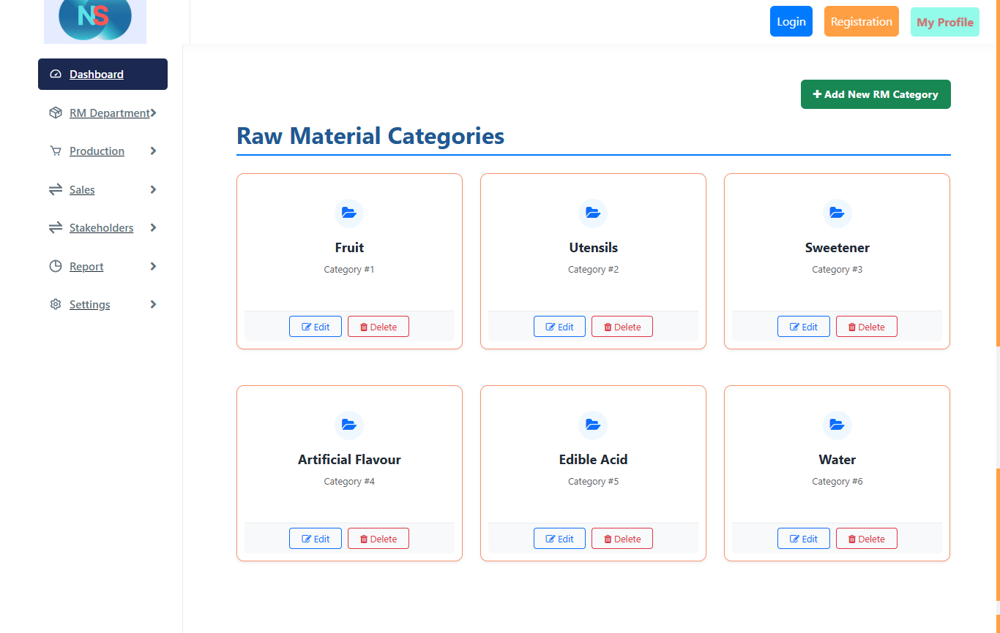

### Supplier List
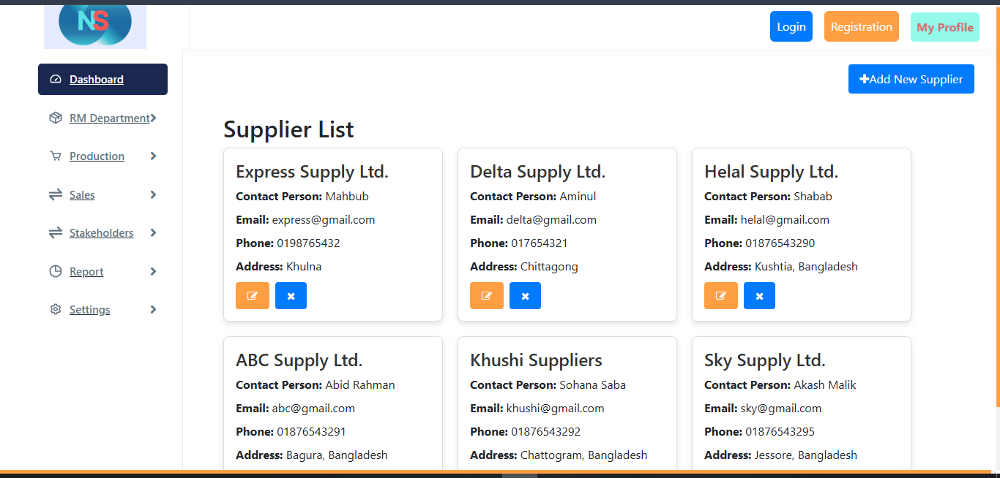

### Supplier Add Form
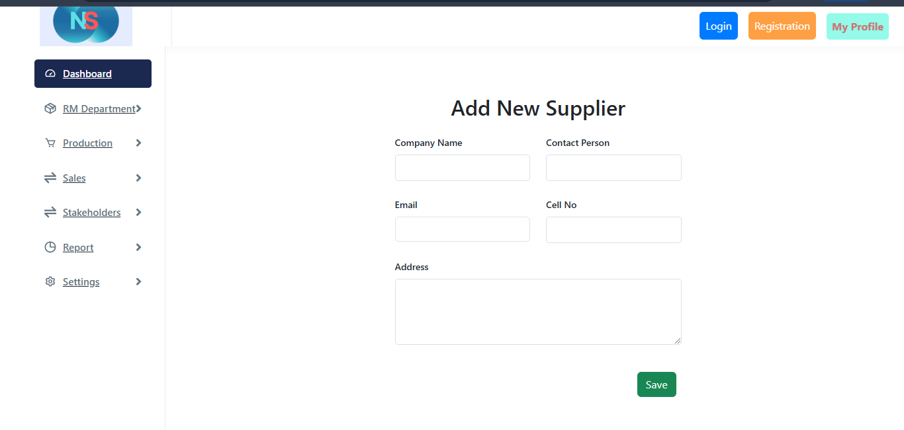

### Raw MAterial List
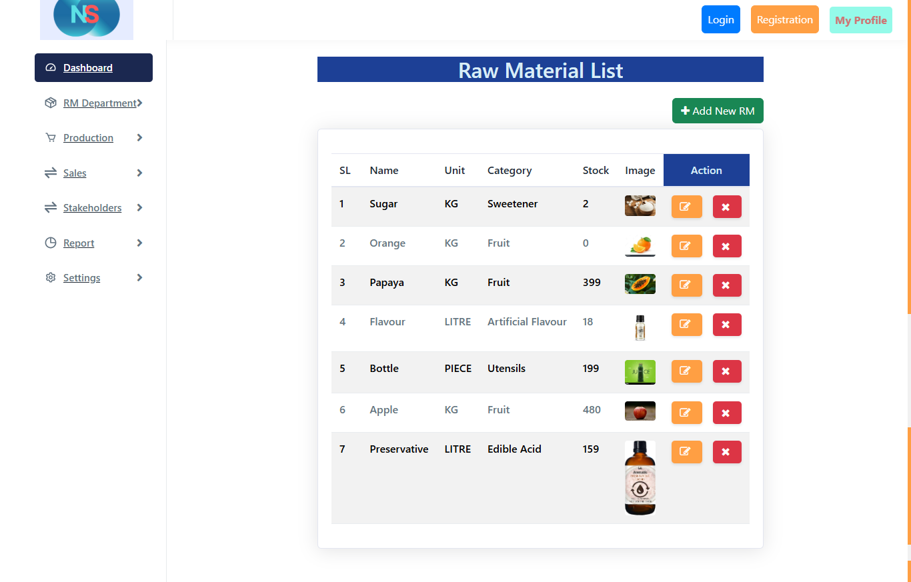

### Raw MAterial Add Form
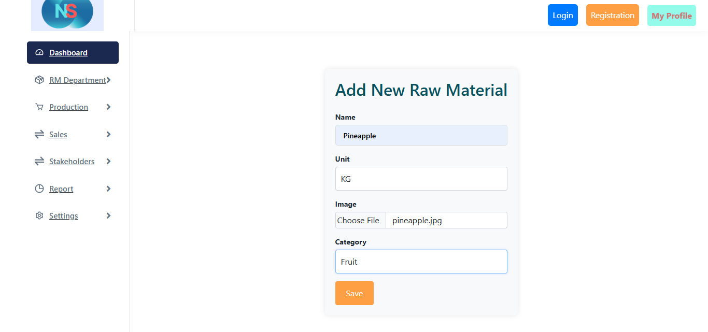

### Procurement Create Form
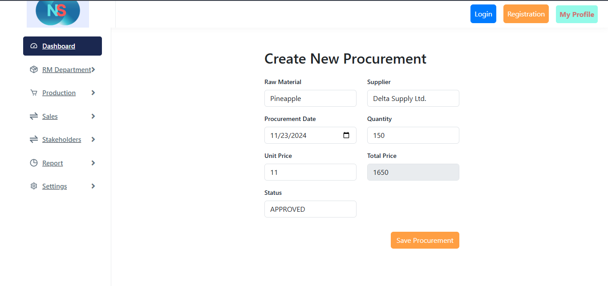

### Procurement List. Raw material Stock remain zero initially. Stock dynamically updates when procurement is approved.
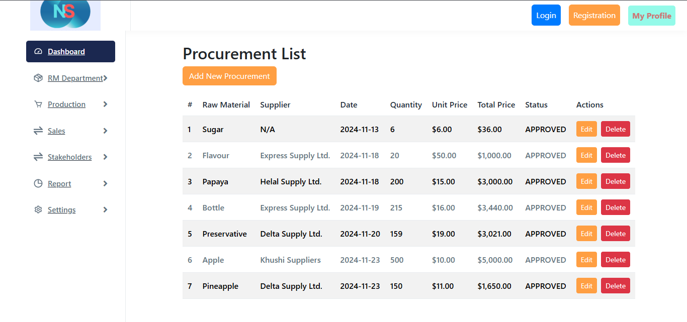

### Product List
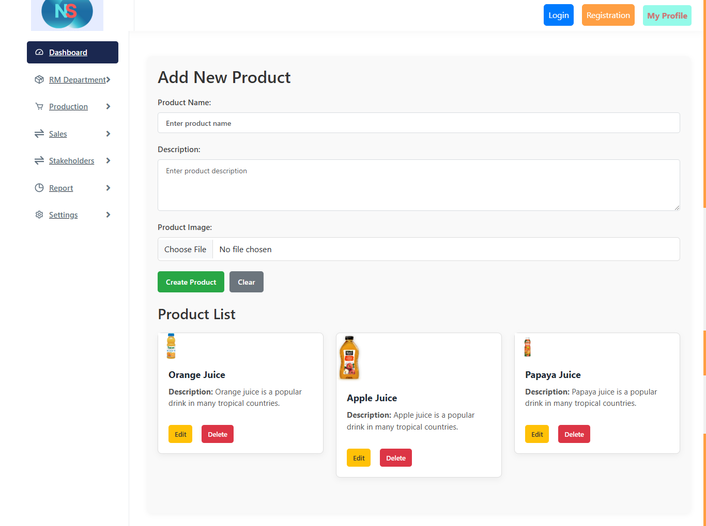

### Product with required raw materials sent in production
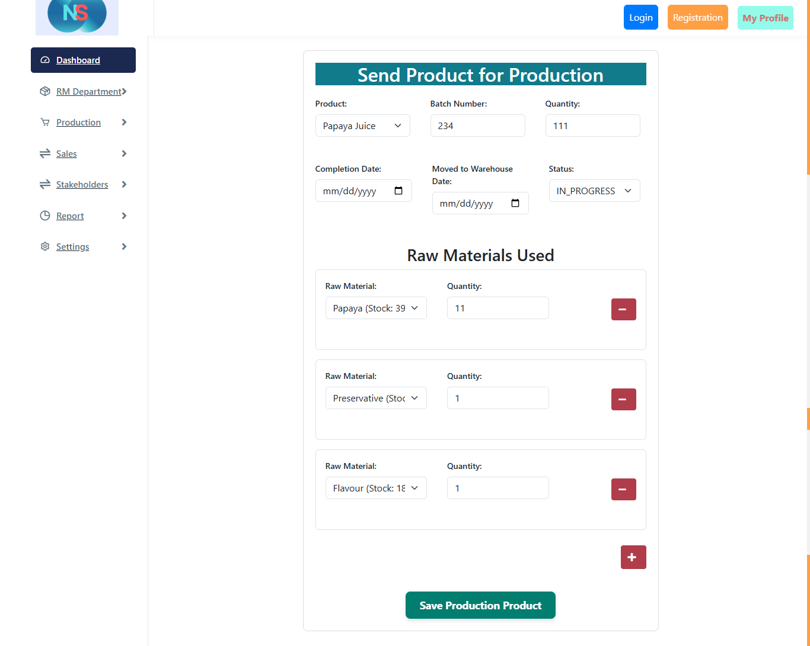

### List of products in production with different status
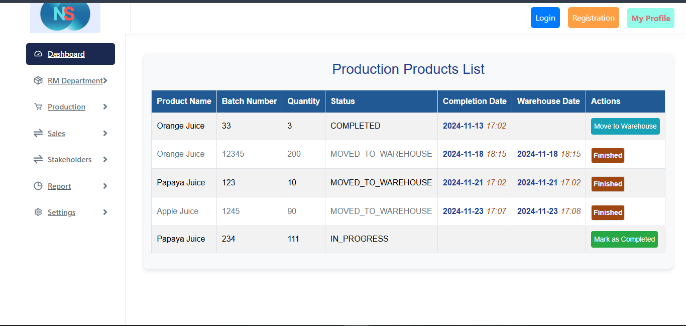

### Finished product is transferred in warehouse when status is "MOVED_TO_WAREHOUSE"


### Warehouse List
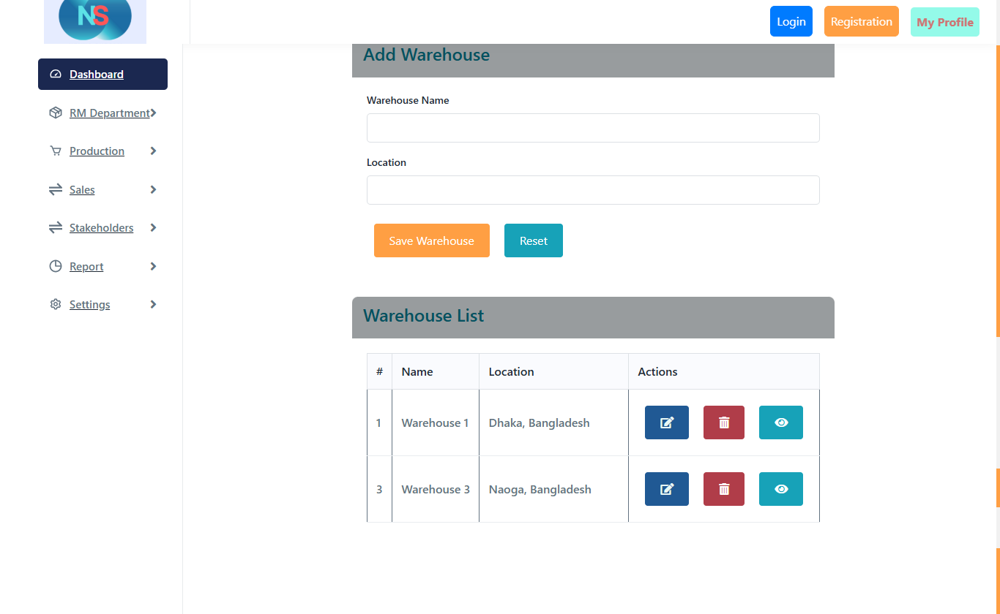

### Finished products in warehouse
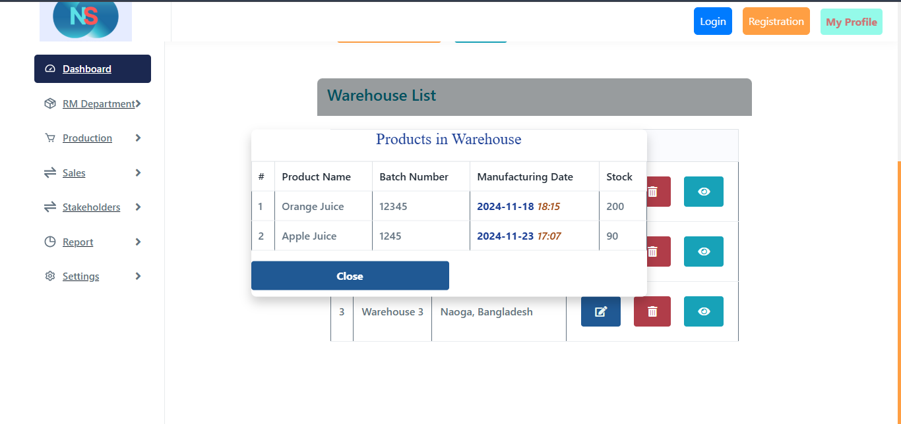

### Retailer add form
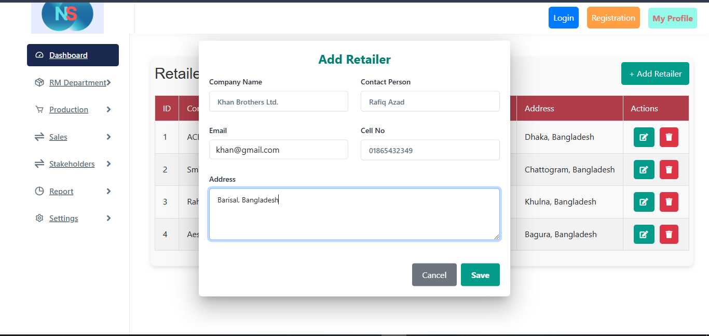

### Retailers List
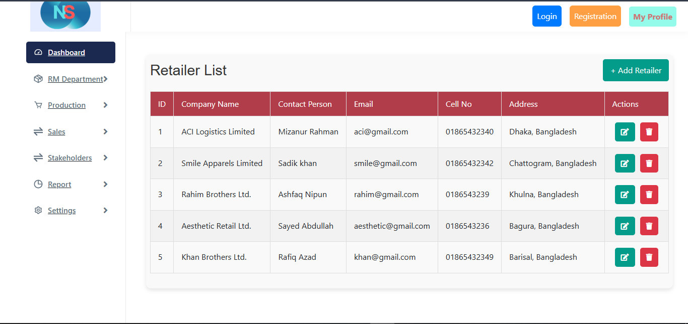

### Sales create form
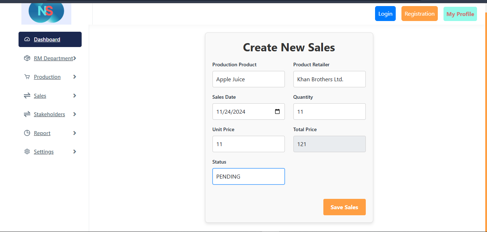

### Apple Juice stock before sale
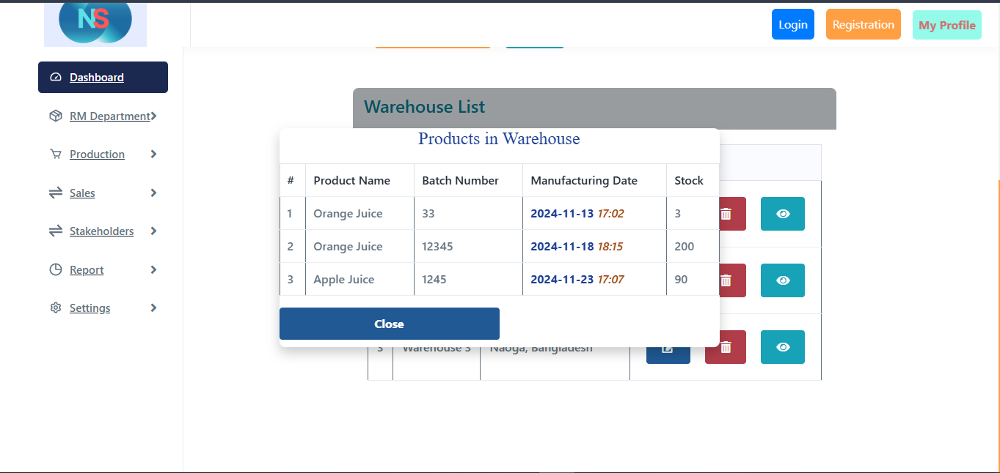

### Sales is approved
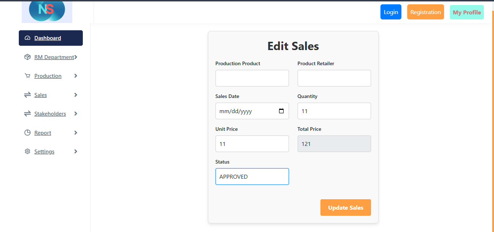

### Apple Juice stock deducted after sale
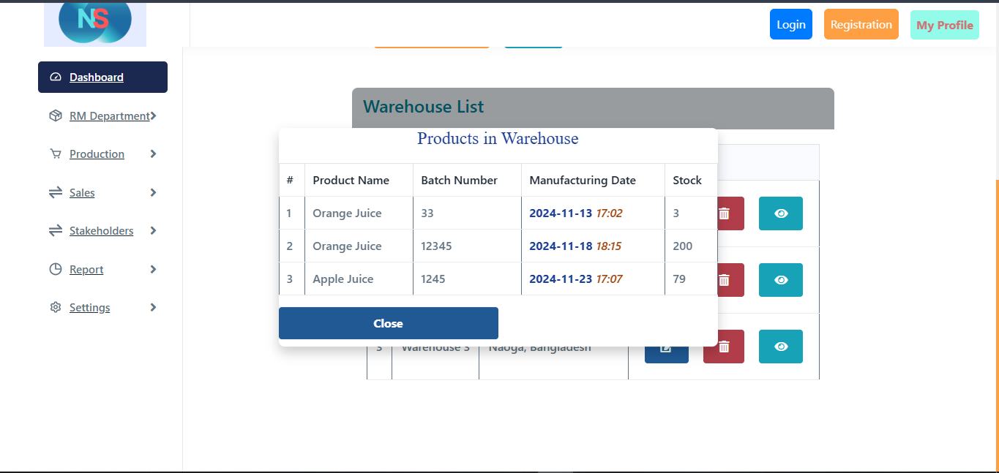

### Dashboard
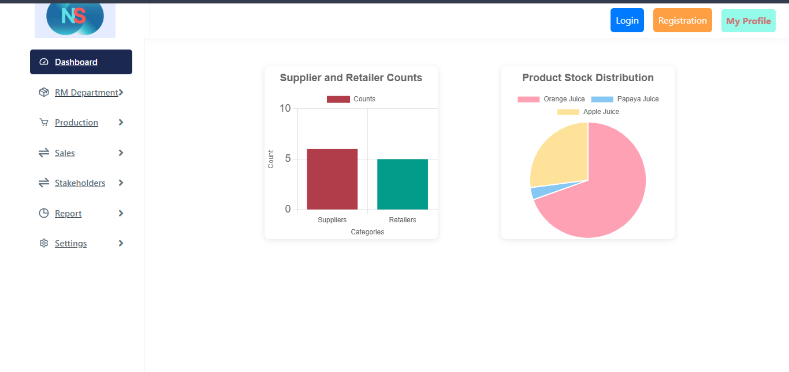


